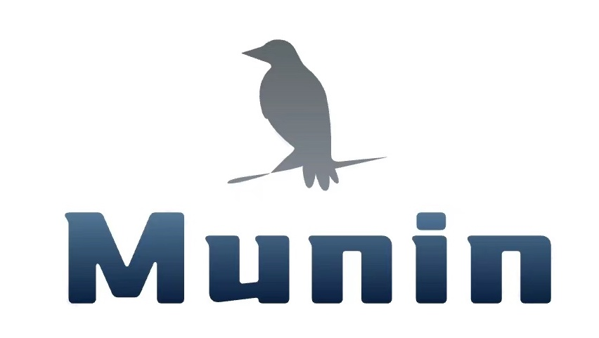

<div  align="center">

</div>

# Munin: Dictionary cache control kit

[](https://www.apache.org/licenses/LICENSE-2.0.html) [](https://gitter.im/qishenghe/munin?utm_source=badge&utm_medium=badge&utm_campaign=pr-badge&utm_content=badge)

-------

## Munin
   &emsp;&emsp;福金（Huginn）和雾尼（Muninn），是北欧神话奥丁（Odin）养的两只乌鸦，福金的名字有“思想”（Thought）的意思，雾尼则是“记忆”（Memory）之意。它们两个每天早上一破晓就飞到人间，到了晚上再回去跟奥丁报告。它们总是栖息于奥丁的肩头同他窃窃耳语。也因此奥丁又被称为“乌鸦神”。（从百度百科抄的）

## 前言

  &emsp;&emsp;你一定也做过类似于“xx信息管理”这样的模块吧，如果xx表示一个实体的话，那其中一定包含一些属性。有一些属性的可能性数量是无法估计的（例如：姓名，商品名称，手机号。。。），但有一些却不同，他们的可能性是有限的（例如：性别，证件类型，国籍。。。），这些可能性有限的属性通常会以编码的形式进行持久化，然后将编码对应的实际内容持久化在字典表中（例如：男性-编码：1，女性-编码：2）。但是当这些数据显示在界面上的时候，总不能直接显示成（性别：1 或者 性别：2）这种形状吧。这时候，你的接口就需要对字典的编码进行转换。
  
  &emsp;&emsp;现在回想一下，你通常是如何做上面所提到的转换的，你可能会选择写一个函数，或者其他的小东西来专门处理这个问题，（当然我也见过直接join字典表的，结果有一天他遇到了一个含有十多个需要转换的字段的实体）。根据字典表的映射进行一些转换，这是一个非常容易解决小的问题，但恰恰是这个小问题，抢走了开发人员用来思考人生的黄金时间，你不得不一边想着晚上奖励自己的时候该看哪位老师的片子，一边写着这些写了上百遍的脑残代码。那些懒惰又喜欢动一些脑筋的人会封装出一些小玩意来解决这个问题，然后一步一步把它做的更加容易使用，于是，Munin来了

## 什么是Munin

* **更敏捷的字典数据存储介质**

  使用内存（或其他基于内存的DBMS）作为存储介质，存储这些不会太大但是经常要用的字典数据。无论是获取它用来显示，还是用来做一些转换，效率都要比从数据库获取更快

* **更优雅的字典数据转换方案**

  使用注解的方式，直接将一个属性的转换方案捆绑到这个属性的定义上，它不仅更加直观，并且还会省去很多垃圾代码

## 为什么是Munin

* **优雅与规范并存的敏捷开发**
  
  只需要像下面这样，在属性上写一个注解，就能把性别对应的编码转换成这个编码对应的内容

  ```
  @MuninPoint(dictCode = "SEX")
  private String sex;
  ```
  
* **性能与逼格同高的快速转换**

  提供快捷的并行转换方案，以及自定义线程池注入，数据量再大也可以从容应对

* **自律又贴心的缓存容器**

  自定义数据来源之后，周期性或随时手动的触发将数据源的字典同步到内存中，自动将其转换成搜索更加高效的数据结构

* **真正可插拔的高可用性**
  
  你的场景不仅仅是字典数据的转换吗？没关系，重写转换函数可以实现任何转换规则，即使不依赖内置的缓存容器，也可以使用

## 快速开始

* **maven坐标**
   
   &emsp;&emsp;groupId : com.github.qishenghe
   
   &emsp;&emsp;artifactId : munin

## 加入我们

* **钉钉**

<div  align="center">

</div>


