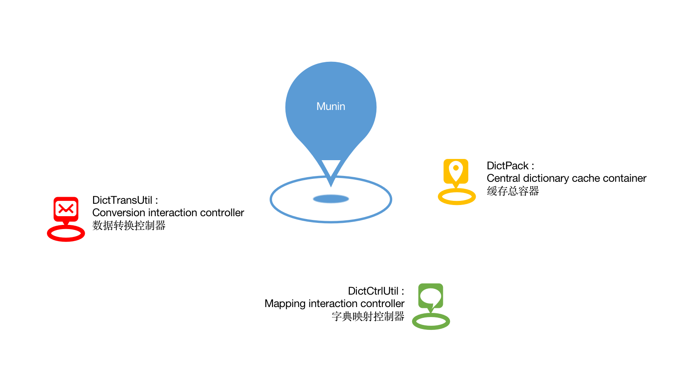

<div  align="center">

</div>

# Munin: Dictionary cache control kit

[](https://www.apache.org/licenses/LICENSE-2.0.html) [](https://gitter.im/qishenghe/munin?utm_source=badge&utm_medium=badge&utm_campaign=pr-badge&utm_content=badge)

-------

## Munin
   &emsp;&emsp;Hugin（Huginn）and Munin（Muninn），They are two crows raised by Odin, a Nordic myth，Hugin's name means "thought"，Munin means "memory". The two of them fly to the world at dawn every morning, and then go back to report to Odin in the evening. They always perched on Odin's shoulder and whispered to him. Therefore, Odin is also known as "Raven God". (copied from Baidu Encyclopedia)

## Preface

* **Origin**

  &emsp;&emsp;You must have done modules like "XX information management". If XX represents an entity, it must contain some attributes. The number of possible attributes cannot be estimated (for example, name, product name, mobile phone number...), But some are different, and their possibilities are limited (for example, gender, certificate type, nationality...), These attributes with limited possibilities are usually persisted in the form of encoding, and then the actual content corresponding to the encoding is persisted in the dictionary table (for example: male encoding: 1, female encoding: 2). But when these data are displayed on the interface, they can't be directly displayed in this shape (gender: 1 or gender: 2). At this time, your interface needs to convert the code of the dictionary.
  
  &emsp;&emsp;Now recall how you usually do the above-mentioned conversion. You may choose to write a function or other small things to deal with this problem. (of course, I have also seen the direct join dictionary table, and one day he encountered an entity containing more than ten fields that need to be converted). According to the mapping of the dictionary table, it is a small problem that is very easy to solve, but it is precisely this small problem that robs developers of the golden time to think about life. You have to think about which teacher's film to watch when you reward yourself in the evening, while writing these brain disabled codes that have been written hundreds of times. Those lazy people who like to use their brains will package some gadgets to solve this problem, and then make it easier to use step by step. So Munin came

* **Logical architecture**

<div  align="center">

</div>

## What is Munin

* **More agile dictionary data storage media**

  Use memory (or other memory based DBMS) as the storage medium to store these dictionary data that are not too large but often used. Whether it is used for display or for some conversion, the efficiency is faster than that from the database

* **More elegant dictionary data conversion scheme**

  Using annotations to directly bind the conversion scheme of an attribute to the definition of this attribute is not only more intuitive, but also saves a lot of junk code

## Why is Munin

* **Agile development with elegance and specification**
  
  Just write an annotation on the attribute like the following to convert the gender corresponding code into the content corresponding to this code

  ```
  @MuninPoint(dictCode = "SEX")
  private String sex;
  ```
  
* **Fast conversion with the same performance and style**

  It provides a fast parallel conversion scheme and custom thread pool injection. No matter how large the amount of data is, you can take it easy

* **Self disciplined and considerate cache container**

  After customizing the data source, periodically or manually trigger at any time to synchronize the dictionary of the data source into memory, and automatically convert it into a more efficient data structure for search

* **Truly pluggable high availability**
  
  Is your scenario more than just the conversion of dictionary data? It doesn't matter. Rewriting the conversion function can implement any conversion rule, even if it doesn't rely on the built-in cache container

## Quick start

* **Maven coordinates**
   
   &emsp;&emsp;groupId : com.github.qishenghe
   
   &emsp;&emsp;artifactId : munin

* **Development documentation**

   &emsp;&emsp;[Wiki](https://github.com/qishenghe/munin/wiki/)

## Join us

* **Ding Talk**

<div  align="center">

</div>

<!-- * **Wechat** -->

<!-- <div  align="center"> -->
<!--  -->
<!-- </div> -->
